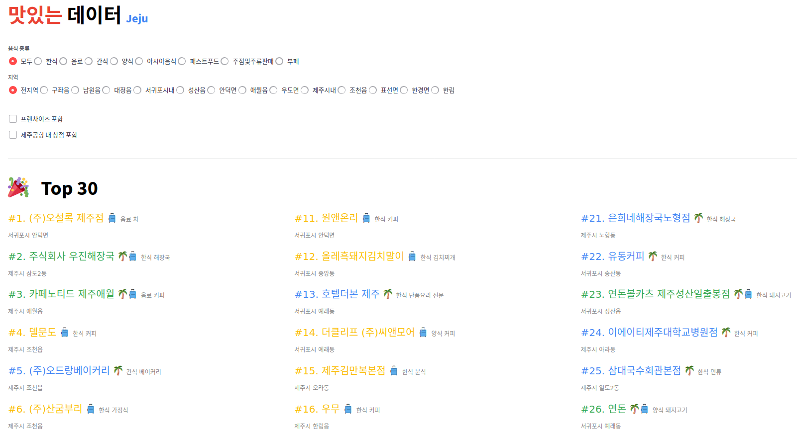

# 맛있는 데이터, Jeju

[streamlit](https://streamlit.io/)를 이용한 제주도 맛집 데이터 분석 예제 입니다.





## Run Demo (on your local computer)

```bash
streamlit run demo.py
```


## Dataset

관광 소비행태 데이터_카드사 음식 급상승 데이터 (2022).*제주관광공사*. Retrieved from [문화 빅데이터 플랫폼](https://www.bigdata-culture.kr/bigdata/user/data_market/detail.do?id=f0306b70-597a-11ec-8ee4-95f65f846b27)


## Contact

질문이나 건의사항은 여기 repo의 issue에 남겨주세요!

맛있는 데이터 관련 브런치 글: https://brunch.co.kr/@mulkkyul


